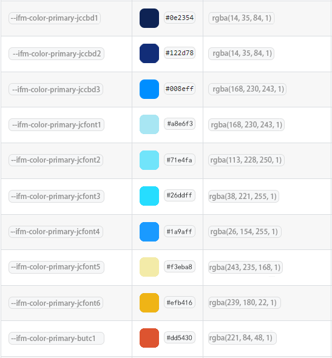

# 监测色系颜色取值

> 其他项目可以按照UI出图自己修改，使用方式相同

### 使用方式

> 粘贴到公共样式文件最顶层，其他地方使用var引用，如：```var(--ifm-color-primary-jccbd1)```

### 颜色预览


### 复制代码
```css
:root {
	--ifm-color-primary-jccbd1: #0E2354;       /*组件的背景色 需要透明度可以使用：rgba(14, 35, 84, 1)*/
	--ifm-color-primary-jccbd2: #122D78;       /*组件的背景色：rgba(18, 45, 120, 1)*/
	--ifm-color-primary-jccbd3: #008EFF;      /*背景： rgba(0, 142, 255, 1)*/

	--ifm-color-primary-jcfont1: #A8E6F3;      /*字体颜色1：rgba(168, 230, 243, 1)*/
	--ifm-color-primary-jcfont2: #71E4FA;      /*字体颜色2：rgba(113, 228, 250, 1)*/
	--ifm-color-primary-jcfont3: #26DDFF;      /*字体颜色3：rgba(38, 221, 255, 1)*/

	--ifm-color-primary-jcfont4: #1A9AFF;      /*字体颜色4：rgba(26, 154, 255, 1)*/

	--ifm-color-primary-jcfont5: #F3EBA8;      /*字体颜色5：rgba(243, 235, 168, 1)*/
	--ifm-color-primary-jcfont6: #EFB416;      /*字体颜色6：rgba(239, 180, 22, 1)*/

	--ifm-color-primary-butc1: #DD5430;      /*字体颜色1：rgba(221, 84, 48, 1)*/
}
```