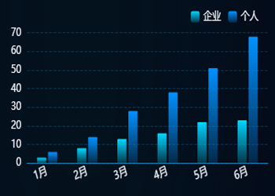

# 柱图

> 这里的截图是从监测真实数据截过来的，可能没有UI上好看，看到有数据的时候我在换一张
 


### 通用方法
```js
//获取到屏幕的宽度echart字体大小
const fontChart = function (res) {
	var clientWidth =
			window.innerWidth ||
			document.documentElement.clientWidth ||
			document.body.clientWidth;
	if (!clientWidth) return; //报错拦截：
	let fontSize = clientWidth / 3840;
	return res * fontSize;
}
```

### 数据展示
```js
const chartlist = {
  chart1: {
    colorList: ["#00B4FF", "#2751EE", "#C76B30"],
    nameList: ["出租车", "网约车", "总数"],
    yname: ["(辆)"],
    types: ["bar", "bar", "line"],
  },
  chart2: {
    colorList: ["#84B333", "#BE8E27"],
    nameList: ["充电桩", "充电量"],
    yname: [""],
    types: ["bar", "bar"],
  },
  chart3: {
    colorList: ["#1BE9BF", "#FFB847"],
    nameList: ["去年客流量", "今年客流量"],
    yname: ["(万人次)"],
    types: ["line", "line"],
  },
  chart4: {
    colorList: ["#00D5FF", "#0091FF"],
    nameList: ["企业", "个人"],
    yname: [""],
    types: ["bar", "bar"],
  },
};
```

### 接收参数
```js
// 组件接口的参数
props: {
  // 图表配置项
  options: {
		type: Object,
		default: {
				keyId: "linename",   // id值
				valType: "chart1",   // 区别名称/颜色
				areaStyle: false,    // 线的面积展示
				lineType: "solid",   // 线的类型
				barRadius: 2,        // 圆角
				barWidth: 18,        // 柱状宽
				barStyle: true,      // 柱状的展示渐变
				smooth: true,        // 线条是否圆滑
				legendT: "5%",       // legendTop
				legendR: "5%",       // legendRight
				grid: {              // 离边边的距离
						left: "6%",
						right: "6%",
						top: "18%",
						bottom: "6%",
						containLabel: true,
				}
		}
	},
  // CHART的数据
  chartData: {
    type: Object,
    default: () => ({
      list1: [2, 5, 8, 15, 9, 7, 13],
      list2: [12, 8, 18, 5, 19, 1, 3],
      xlist: ["1周", "2周", "3周", "4周", "5周", "6周", "7周"],
      name: ["list1", "list2"],
    })
  },
  // X轴上的名称
  ychartData: {
    type: Array,
    default: () => ["1日", "2日", "3日", "4日", "5日", "6日", "7日"],
  }
}
```

### 通用方法
```js
//获取到屏幕的宽度echart字体大小
const fontChart = function (res) {
  var clientWidth =
      window.innerWidth ||
      document.documentElement.clientWidth ||
      document.body.clientWidth;
  if (!clientWidth) return; //报错拦截：
  let fontSize = clientWidth / 3840;
  return res * fontSize;
}
```

### 特有方法
```js
// 设置x轴的方法，这个方法在实际开发中可以用也可以不用，具体逻辑请看组件内部
setyAxis() {}
// 设置Series的方法，这个方法在实际开发中可以用也可以不用，具体逻辑请看组件内部
setSeries(newData) {}
```

### 初始化方法
```js
import esSame from "../../../static/file/echarts/types.js";

initCharts(newData) {
  // this.$es 是mian里面对echarts的引用
  const myChart = this.$es.init(document.getElementById(this.options.keyId));
  // echarts配置
  let option = {
    tooltip: {
      //提示框设置
      trigger: "axis",
      ...esSame.TOOL_TIP,
    },
    grid: {
      //设置内容区域距离周边的距离
      ...this.options.grid,
    },
    legend: {
      top: this.options.legendT,
      right: this.options.legendR,
      textStyle: {
        color: "#EAEFF5",
        fontSize: fontChart(24),
      },
      itemWidth: fontChart(24),
      itemHeight: fontChart(24),
    },
    xAxis: [
      {
        type: "category",
        data: newData.xlist,
        ...esSame.X_AXIS,
      },
    ],
    yAxis: this.setyAxis(),
    series: this.setSeries(newData),
  };
	option.xAxis[0].axisLabel.rotate=20
  myChart.setOption(option, true);
};
```

### 使用方式
```js
// 引入文件
import barChartComp from "@/components/charts/lineChart";
// 在VUE中使用并传参
<template>
  // 当数据回来后才显示，默认情况下可以使用LOADING来
	<bar-chart-comp :mapping="mapping" :datas="datas" :options="options" v-if="isShow"></bar-chart-comp>
</template>
```

### 下载地址
[VUE2](../../../static/vueComp/charts/barChart_VUE2.vue) | [VUE3](../../../static/vueComp/charts/barChart_VUE3.vue) | [ES_SAME](../../../static/file/echarts/types.js)
