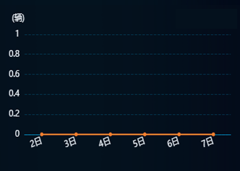

# 线图

> 这里的截图是从监测真实数据截过来的，可能没有UI上好看，看到有数据的时候我在换一张
 


### 通用方法
```js
//获取到屏幕的宽度echart字体大小
const fontChart = function (res) {
    var clientWidth =
        window.innerWidth ||
        document.documentElement.clientWidth ||
        document.body.clientWidth;
    if (!clientWidth) return; //报错拦截：
    let fontSize = clientWidth / 3840;
    return res * fontSize;
}
```

### 接收参数
```js
state() {},
// 组件接口的参数
props: {
  // 图表配置项
  options: {
    type: Object,
    default: {
      keyId:  "linename",  // id值
      legends: false,      // legend展示
      areaStyle: true,     // 线的面积展示
      yname: "(个)",       // y轴名称
      name: "",            // 数据名称
      color: "#26CF99",    // 颜色，可以是数组
      smooth: true,        // 线条是否圆润
      symbol: "none",      // 标记点类型
      point: 10,           // 标记点大小
      legendT: "5%",       // legendTop
      legendR: "5%",       // legendRight
    }
  },
  // CHART的数据
  chartData: {
    type: Array,
    default: () => [0, 0, 0, 0, 0, 0, 0],
  },
  // X轴上的名称
  ychartData: {
    type: Array,
    default: () => ["1日", "2日", "3日", "4日", "5日", "6日", "7日"],
  }
}
```

### 通用方法
```js
//获取到屏幕的宽度echart字体大小
const fontChart = function (res) {
  var clientWidth =
      window.innerWidth ||
      document.documentElement.clientWidth ||
      document.body.clientWidth;
  if (!clientWidth) return; //报错拦截：
  let fontSize = clientWidth / 3840;
  return res * fontSize;
}
```

### 初始化方法
```js
import esSame from "../../../static/file/echarts/types.js";

initCharts() {
  // this.$es 是mian里面对echarts的引用
  const myChart = this.$es.init(document.getElementById(props.keyId));
  // echarts配置
  const option = {
    tooltip: {
      // //提示框设置
      trigger: "axis",
      ...esSame.TOOL_TIP,
    },
    grid: {
      ...esSame.GRID_STYLE,
      top: "18%",
    },
    legend: {
      show: this.options.legends,
      orient: "horizontal",
      top: this.options.legendT,
      right: this.options.legendR,
      textStyle: {
        color: "#EAEFF5",
        fontSize: fontChart(24),
      },
      itemWidth: fontChart(24),
    },
    dataZoom: [esSame.ZOOM_DATA],
    xAxis: [
      {
        type: "category",
        data: this.options.ychartData,
        ...esSame.X_AXIS,
      },
    ],
    yAxis: [
      {
        type: "value",
        name: this.options.yname,
        ...esSame.Y_AXIS,
      },
    ],
    series: [
      {
        name: this.options.name,
        type: "line",
        smooth: this.options.smooth, //线条是否圆润
        symbol: this.options.symbol, //标记点类型
        symbolSize: fontChart(this.options.point), //标记点大小
        data: this.options.chartData,
        itemStyle: {
          //线
          color: this.options.color,
        },
        areaStyle: {
          // 区域渐变色
          color: new es.graphic.LinearGradient(0, 0, 0, 1, [
            {
              offset: 0,
              color: this.options.areaStyle ? this.options.color + "99" : this.options.color + "00",
            },
            {
              offset: 1,
              color: this.options.areaStyle ? this.options.color + "1a" : this.options.color + "00",
            },
          ]),
        },
      },
    ],
  };
  myChart.setOption(option, true);
};
```

### 使用方式
```js
// 引入文件
import lineChartComp from "@/components/charts/lineChart";
// 在VUE中使用并传参
<template>
  // 当数据回来后才显示，默认情况下可以使用LOADING来
	<list-chart-comp :mapping="mapping" :datas="datas" :options="options" v-if="isShow"></list-chart-comp>
</template>
```

### 下载地址
[VUE2](../../../static/vueComp/charts/lineChart_VUE2.vue) | [VUE3](../../../static/vueComp/charts/lineChart_VUE3.vue) | [ES_SAME](../../../static/file/echarts/types.js)
