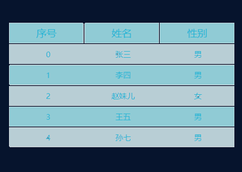

# 列表类



### 组件参数
```js
const params = {
	mapping: {  // Object，用来映射TITLE
		'id': '序号',
		'name': '姓名',
		'sex': '性别'
	},
	datas: {  // Object，灌入数据，字段需要和mapping保持一致
		...
		{
			id: 1,
			name: '李四',
			sex: '男'
		},
		...
	},
	options: {
		openStripe: true,                       // 是否开启斑马线
		textColor: '#26DDFF',                   // 文字颜色
		keysBG: 'rgba(0, 234, 255, .3)',        // 头部TITLE的背景色
		stripesColor: 'rgba(0, 234, 255, .1)'   // 斑马线的浅色部份
	}
}
```
### 使用方式
```js
// 引入文件
import ListComp from "../list.vue";
// 在VUE中使用并传参
<template>
	<list-comp :mapping="mapping" :datas="datas" :options="options"></list-comp>
</template>
```

### 下载地址
[VUE2](../../static/vueComp/list.vue)

